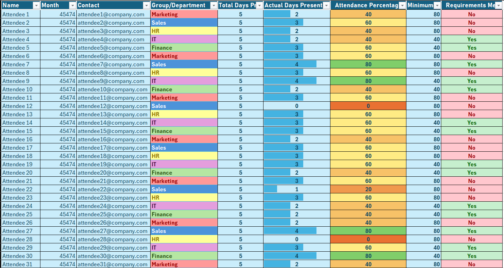
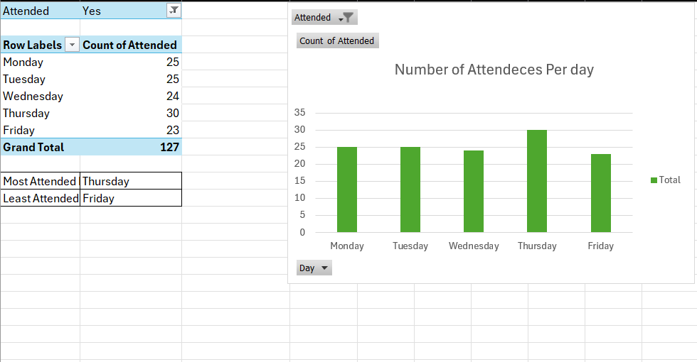
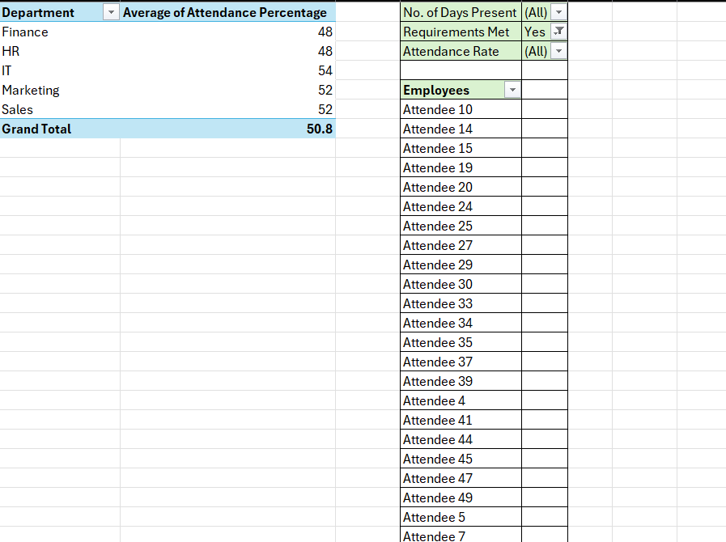

# Automated Attendance Tracker (Excel)

I designed a self-updating Excel tracker that consolidates three disconnected data sources, calculates attendance rates, and flags unmet requirements across five departments — replacing hours of manual cross-referencing with a refreshable, policy-aware system.

## The key insight

Every department showed nearly identical attendance (48–54%) — yet pass rates diverged sharply. The difference wasn't behavior. It was the thresholds.

The source data lived in three disconnected sheets: employee details, department assignments with per-department attendance requirements, and a raw daily attendance log. There was no way to see who was meeting their requirement without manual cross-referencing — and no way to notice that the requirements themselves, not the people, were driving who "passed."

## What the data showed

**1. Attendance peaked on Thursday and dropped hardest on Friday.**
Thursday drew 30 attendees (the week's high); Friday fell to 23 (the low), out of 127 total attendances. → Schedule critical sessions mid-to-late week; investigate Fridays.

**2. No department is genuinely "better" at showing up.**
Average attendance ranged only from 48% (Finance, HR) to 54% (IT), with Marketing and Sales at 52%. IT topped the pass-rate table mainly because its requirement is 40%, versus 80% for others. → Judging teams on raw pass rates alone would misdiagnose a culture problem that doesn't exist.

**3. Only a handful of individuals met their requirement.**
With overall attendance averaging 50.8%, just seven attendees cleared their department's bar. → Either attendance needs intervention, or the 80% thresholds need a policy review — the tracker gives leadership the evidence to decide.

## How I built it

- **Consolidated three sources into one.** I merged contact details and department assignments into a single tracker with `XLOOKUP`, after using duplicate detection to clean the master name list.
- **Automated the attendance count.** I calculated each person's actual days present from the raw daily log with `SUMIF`, and derived the working-day total from date arithmetic.
- **Applied policy, not one blanket rule.** I looked up each department's own threshold (80% or 40%) and built a pass/fail check with `IF` logic, so individuals are measured against *their* requirement.
- **Made risk visible at a glance.** I layered conditional formatting — green/red requirement flags, per-department colors, data bars, and a color scale on attendance percentage.
- **Answered the management questions.** I built PivotTables and a chart for the questions leaders actually ask: strongest and weakest days, department averages, and who is meeting requirements.
- **Turned it into a repeatable process.** I saved the workbook as a template so each new tracking period starts from a working system, and used Excel Copilot to accelerate formatting and duplicate checks.

## Business value

- **Hours back, every cycle** — attendance reporting recurs; what took hours of cross-referencing now takes a refresh.
- **Fewer errors where errors cost** — attendance feeds payroll and policy; formula-driven consolidation is consistent and auditable.
- **Early warning, not autopsy** — red flags appear while the period is live, so managers can intervene before a requirement is missed.
- **Answers, not raw data** — leadership gets direct answers instead of a log to decipher.

Attendance is just the use case. The same architecture — consolidate scattered sources, apply business rules, surface exceptions visually, summarize for decisions — applies to expense tracking, inventory, sales targets, and project deadlines.

## Skills demonstrated

`XLOOKUP` · `SUMIF` · PivotTables · nested `IF` logic · conditional formatting · structured tables · date arithmetic · Excel Copilot · template design

## Files in this repo

| File | Description |
|---|---|
| `AttendanceTracker.xlsx` | The completed workbook — tracker, PivotTables, and chart |
| `screenshots/` | Output previews |

---

*Connect with me on [LinkedIn](https://www.linkedin.com/in/imamul-kabir-rivu/).*
